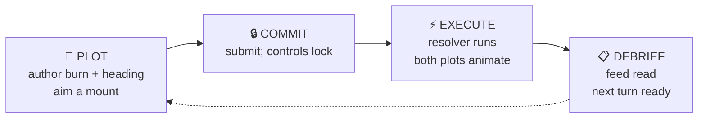

<p align="center">
  <picture>
    <source media="(prefers-color-scheme: light)" srcset="docs/assets/logo/burn-vector-logo-light.svg">
    
  </picture>
</p>

<p align="center"><em>A turn-based tactical starship-combat duel. Plot. Commit. Execute. Debrief.</em></p>

<p align="center">
  <a href="LICENSE"></a>
  <a href="package.json"></a>
  <a href="docs/developer/testing.md"></a>
  <a href="CHANGELOG.md"></a>
  <a href="PLAN.md"></a>
</p>

<p align="center">
  
</p>

---

## What is Burn Vector?

A tactical, turn-based starship-combat duel with a pure shared resolver and a ship-schematic-centric interface. Two identical ships start symmetric; one goes home. Built as a deployable vertical slice — everything you see is wired through a real peer-hosted multiplayer stack.

It's an homage to tabletop starship combat (Star Fleet Battles, Federation Commander, Attack Vector: Tactical, Full Thrust, Triplanetary, Mayday / Brilliant Lances) that takes full advantage of the digital medium: continuous Newtonian movement, plot-commit-execute-debrief loops, and an SSD that the player plays *with* rather than through.

> **Design thesis** — the Ship System Display is not a skin over a hull bar. It is a map of the ship you are actually flying. Where the reactor sits matters. Where the drive sits matters. A hit *near the bridge* reads differently from a hit *near the mount*.

---

## Quickstart

Node.js 24+ required.

```bash
git clone https://github.com/ajeless/burn-vector.git
cd burn-vector
npm install
# In one terminal:
npm run dev:server
# In another:
npm run dev:client
```

Open <kbd>http://localhost:5173</kbd> in two browser tabs to play both sides of a duel.

### Want to just watch?

Append `?demo=1` to the client URL (`http://localhost:5173/?demo=1`) to watch a canned turn resolve without needing a second tab or the server. No interactivity — the replay simply plays.

---

## How it plays



<table>
<tr>
<td width="33%" valign="top" align="center">
  
  <br><b>PLOT</b>
  <br><sub>Plot your burn and aim a weapon from the ship schematic.</sub>
</td>
<td width="33%" valign="top" align="center">
  
  <br><b>EXECUTE</b>
  <br><sub>Both plots resolve animated — you watch your decisions play out.</sub>
</td>
<td width="33%" valign="top" align="center">
  
  <br><b>DEBRIEF</b>
  <br><sub>Debrief sets up the next turn with everything that just happened visible.</sub>
</td>
</tr>
</table>

### The turn loop, in detail

| phase       | you do                                    | the game does                                  |
|-------------|-------------------------------------------|------------------------------------------------|
| **PLOT**    | set burn, heading, aim intent             | validates against ship contracts               |
| **COMMIT**  | submit; controls lock                     | waits for opponent                             |
| **EXECUTE** | watch                                     | resolves both plots with one deterministic seed |
| **DEBRIEF** | read the feed; next-turn state is ready   | replays events, applies damage, reopens plot   |

---

## How it works

Three layers:

- **Client** — vanilla TypeScript + DOM. No framework. Plot authoring, tactical camera, SSD renderer.
- **Shared** — pure logic: contracts, validation, the turn resolver. No DOM, no filesystem, no wall clock.
- **Server** — Node + `ws`. Peer-authoritative host. Resolves turns and broadcasts results.

```
┌── CLIENT ──────────────┐   ┌── SHARED ─────────────┐   ┌── SERVER ──────────┐
│  vanilla TS + DOM      │   │  pure logic · no DOM  │   │  Node + ws         │
│  tactical camera       │◄─►│  contracts            │◄─►│  peer-authoritative│
│  SSD renderer          │   │  validation           │   │  turn resolver     │
│  plot authoring        │   │  resolver/*           │   │  broadcast         │
└────────────────────────┘   └───────────────────────┘   └────────────────────┘
```

See [docs/design/architecture.md](docs/design/architecture.md) for layer diagrams and the turn-loop sequence.

---

## Testing

| Tier                | Runner                  | Asserts                                           |
|:--------------------|:------------------------|:--------------------------------------------------|
| **Contract**        | Vitest                  | JSON shapes don't regress                         |
| **Unit**            | Vitest                  | Shared logic, resolver, plot authoring, presenters |
| **Property**        | Vitest + `fast-check`   | Resolver determinism across arbitrary seeds       |
| **Browser smoke**   | Playwright              | Real duel flow, end to end                        |

```bash
npm test                     # Vitest
npm run test:coverage        # + HTML coverage report
npm run test:browser:smoke   # Playwright
npm run check                # typecheck + Vitest
```

`src/shared/` holds an **85%** line / function / statement threshold.
See [docs/developer/testing.md](docs/developer/testing.md).

---

## Built with

<p align="center">
  <a href="https://www.typescriptlang.org/"></a>
  <a href="https://nodejs.org/"></a>
  <a href="https://vitejs.dev/"></a>
  <a href="https://vitest.dev/"></a>
  <a href="https://playwright.dev/"></a>
  <a href="https://github.com/websockets/ws"></a>
  <a href="https://github.com/dubzzz/fast-check"></a>
</p>

- [**TypeScript**](https://www.typescriptlang.org/) — strict static types across client, server, and shared code.
- [**Node.js**](https://nodejs.org/) — host server runtime; version 24+ required.
- [**Vite**](https://vitejs.dev/) — client development server and production bundler.
- [**Vitest**](https://vitest.dev/) — unit tests, contract tests, property tests. 87 tests across the suite.
- [**Playwright**](https://playwright.dev/) — browser regression suite covering real duel flows.
- [**ws**](https://github.com/websockets/ws) — peer-to-peer WebSocket transport.
- [**fast-check**](https://github.com/dubzzz/fast-check) — property-based testing for resolver determinism.

---

## Lineage

Burn Vector is an homage to the tabletop tactical starship-combat lineage:

- Star Fleet Battles (Amarillo Design Bureau)
- Federation Commander (ADB)
- Attack Vector: Tactical (Ad Astra Games)
- Full Thrust (Ground Zero Games)
- Triplanetary (GDW / Steve Jackson Games)
- Mayday / Brilliant Lances (GDW)

If you came up on any of those, you'll recognize the DNA.

---

## Status

```
  ┌──────────────────────────────────────────────────────────┐
  │  v0.3 · MAINTENANCE MODE                                 │
  │  Feature development retired.                            │
  │  Project stands as a portfolio artifact:                 │
  │    · full-stack strict TypeScript                        │
  │    · deterministic-resolver architecture                 │
  │    · peer-hosted multiplayer                             │
  │    · comprehensive test suite (87 tests)                 │
  └──────────────────────────────────────────────────────────┘
```

See [CHANGELOG.md](CHANGELOG.md) for version history and [PLAN.md](PLAN.md) for the parked-work record.

---

## License

[MIT](LICENSE) © 2026 ajeless
