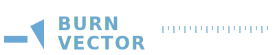
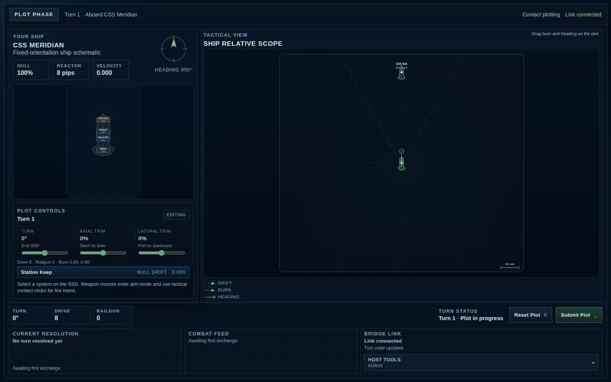
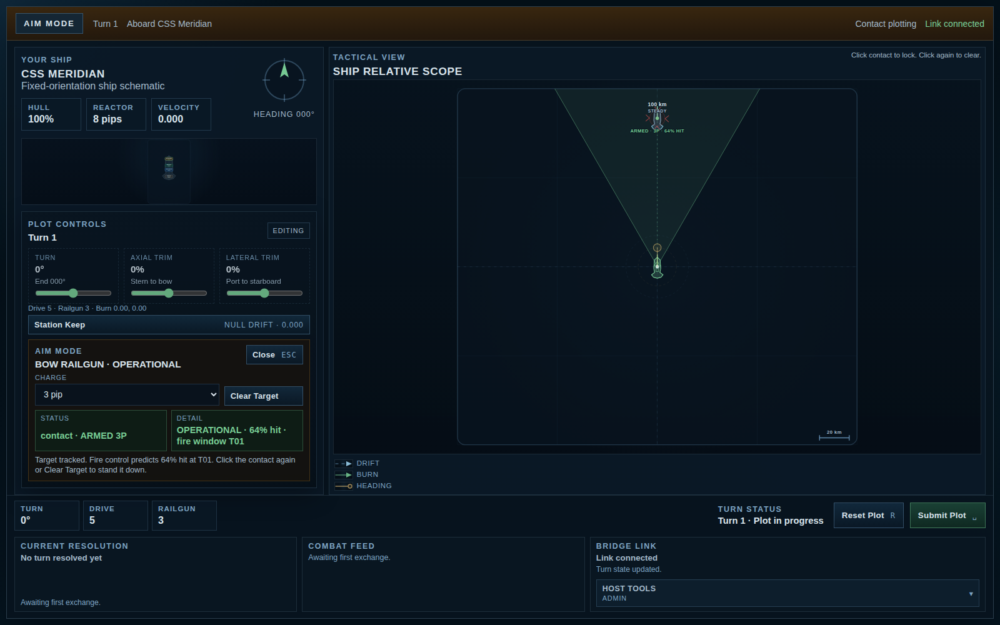
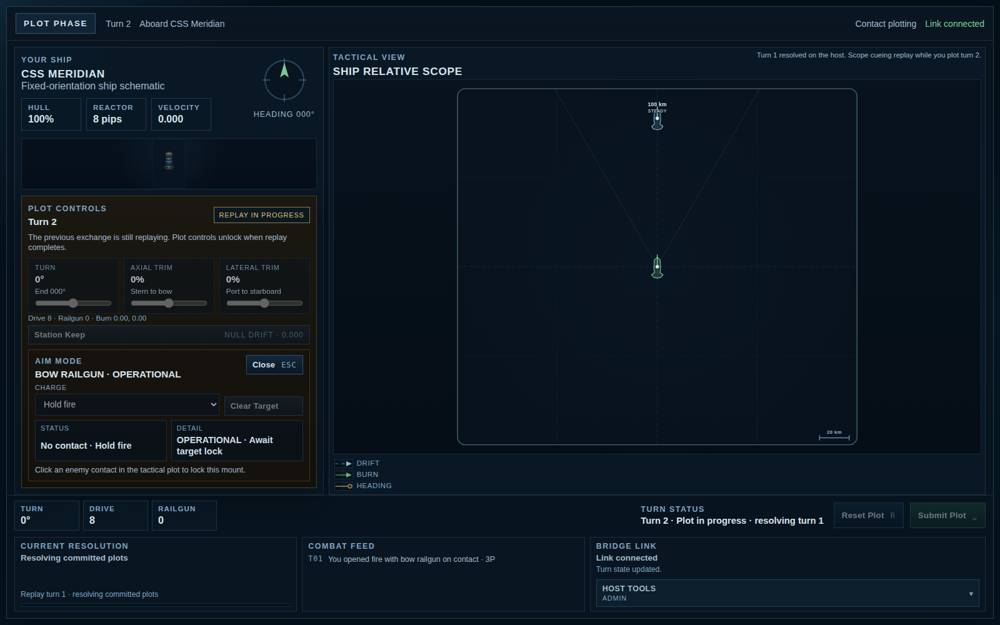
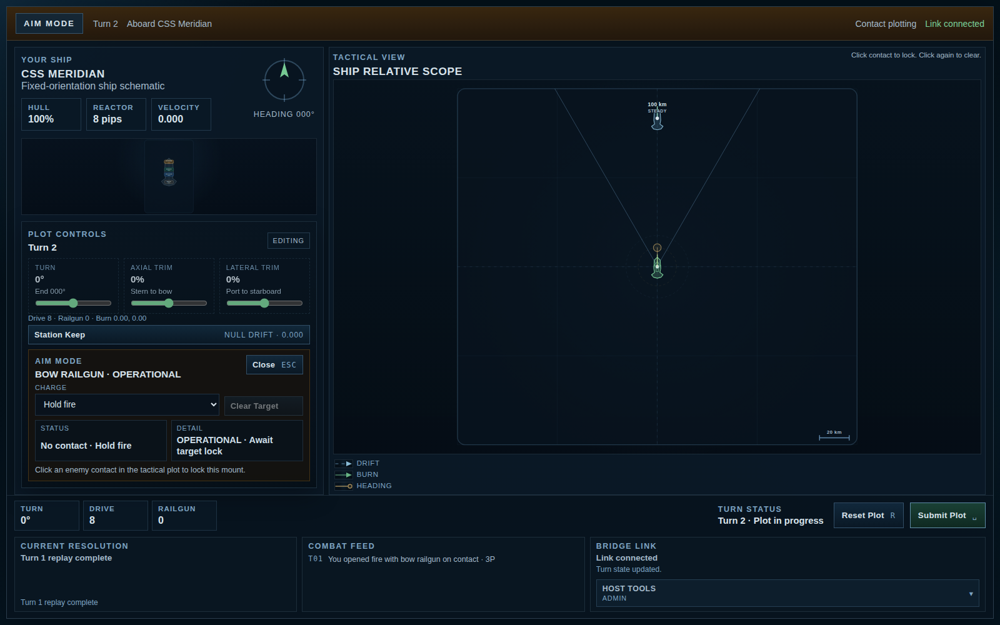

<p align="center">
  
</p>

<p align="center"><em>A turn-based tactical starship-combat duel. Plot. Commit. Execute. Debrief.</em></p>

<p align="center">
  <a href="LICENSE"></a>
  <a href="package.json"></a>
  <a href="docs/developer/testing.md"></a>
</p>

<p align="center">
  
</p>

## What is Burn Vector?

A tactical, turn-based starship-combat duel with a pure shared resolver and a ship-schematic-centric interface. Two identical ships start symmetric; one goes home. Built as a deployable vertical slice — everything you see is wired through a real peer-hosted multiplayer stack.

It's an homage to tabletop starship combat (Star Fleet Battles, Federation Commander, Attack Vector: Tactical, Full Thrust, Triplanetary, Mayday/Brilliant Lances) that takes full advantage of the digital medium: continuous Newtonian movement, plot-commit-execute-debrief loops, and an SSD that the player plays *with* rather than through.

## Quickstart

Node.js 24+ required.

```bash
git clone https://github.com/ajeless/burn-vector.git
cd burn-vector
npm install
# In one terminal:
npm run dev:server
# In another:
npm run dev:client
```

Open http://localhost:5173 in two browser tabs to play both sides of a duel.

### Want to just watch?

Append `?demo=1` to the client URL (http://localhost:5173/?demo=1) to watch a canned turn resolve without needing a second tab or the server. No interactivity — the replay simply plays.

## Gameplay

<p align="center">
  
  <br><em>Plot your burn and aim a weapon from the ship schematic.</em>
</p>

<p align="center">
  
  <br><em>Both plots resolve animated — you watch your decisions play out.</em>
</p>

<p align="center">
  
  <br><em>Debrief sets up the next turn with everything that just happened visible.</em>
</p>

## How it works

Three layers:

- **Client** — vanilla TypeScript + DOM. No framework. Plot authoring, tactical camera, SSD renderer.
- **Shared** — pure logic: contracts, validation, the turn resolver. No DOM, no filesystem, no wall clock.
- **Server** — Node + `ws`. Peer-authoritative host. Resolves turns and broadcasts results.

See [docs/design/architecture.md](docs/design/architecture.md) for layer diagrams and the turn-loop sequence.

## Built with

<p align="center">
  <a href="https://www.typescriptlang.org/"></a>
  <a href="https://nodejs.org/"></a>
  <a href="https://vitejs.dev/"></a>
  <a href="https://vitest.dev/"></a>
  <a href="https://playwright.dev/"></a>
  <a href="https://github.com/websockets/ws"></a>
  <a href="https://github.com/dubzzz/fast-check"></a>
</p>

- [**TypeScript**](https://www.typescriptlang.org/) — strict static types across client, server, and shared code.
- [**Node.js**](https://nodejs.org/) — host server runtime; version 24+ required.
- [**Vite**](https://vitejs.dev/) — client development server and production bundler.
- [**Vitest**](https://vitest.dev/) — unit tests, contract tests, property tests. 87 tests across the suite.
- [**Playwright**](https://playwright.dev/) — browser regression suite covering real duel flows.
- [**ws**](https://github.com/websockets/ws) — peer-to-peer WebSocket transport.
- [**fast-check**](https://github.com/dubzzz/fast-check) — property-based testing for resolver determinism.

## Inspiration

Burn Vector is an homage to the tabletop tactical starship-combat lineage:

- Star Fleet Battles (Amarillo Design Bureau)
- Federation Commander (ADB)
- Attack Vector: Tactical (Ad Astra Games)
- Full Thrust (Ground Zero Games)
- Triplanetary (GDW / Steve Jackson Games)
- Mayday / Brilliant Lances (GDW)

If you came up on any of those, you'll recognize the DNA.

## Status

**v0.3 — maintenance mode.** Feature development is retired; the project stands as a portfolio artifact showcasing a full-stack TypeScript game prototype with deterministic-resolver architecture, peer-hosted multiplayer, and a comprehensive test suite.

See [CHANGELOG.md](CHANGELOG.md) for version history and [PLAN.md](PLAN.md) for the parked-work record.

## License

[MIT](LICENSE) © 2026 ajeless
