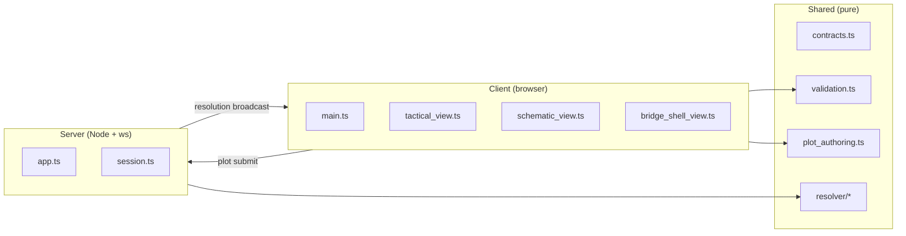
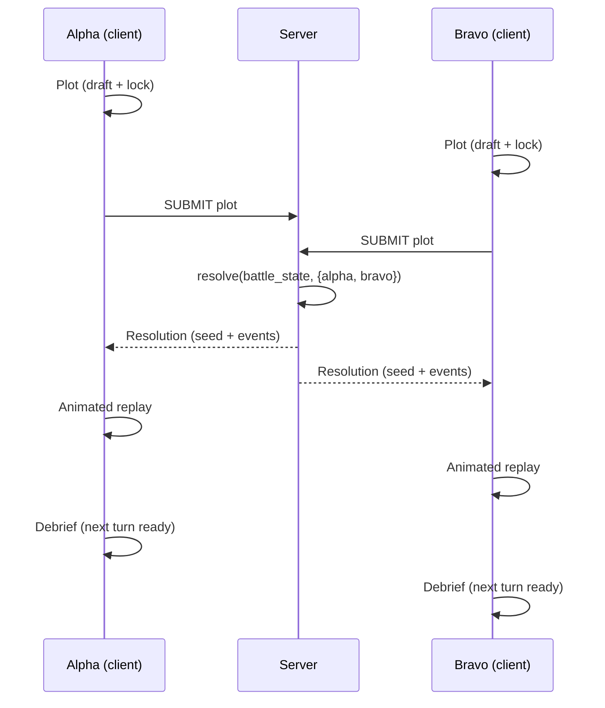

# Architecture

**Status:** current  
**Audience:** contributors, reviewers

> One-page map of how Burn Vector's code is organized.

## Layers

## Turn loop

## Boundaries

- **`src/shared/` is pure.** No DOM, no filesystem, no wall clock, no network. Everything gameplay-relevant lives here.
- **`src/server/` is authoritative.** The resolver runs server-side; clients don't resolve their own turns.
- **`src/client/` is presentation only.** Plot authoring exists client-side but is validated server-side against the shared contracts.

## See also

- Resolver internals: [resolver_design.md](./resolver_design.md)
- Ship definition shape: [ship_definition_format.md](./ship_definition_format.md)
- Layered UI camera: [planner_ui_and_tactical_camera.md](./planner_ui_and_tactical_camera.md)
- Test strategy: [../developer/testing.md](../developer/testing.md)
