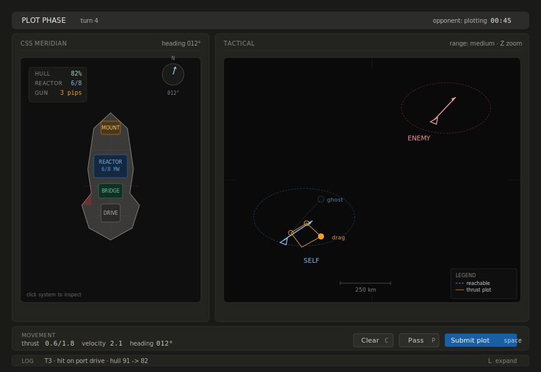

# SSD layout — v0.1

> Imported from `ajeless/docs/sg/space_game_2/design/ssd_layout.md` on 2026-04-21.
> This copy is now maintained in this repository.

**Status:** decided (structure and v0.1 interaction model), deferred (visual design)
**Scope:** v0.1 vertical slice
**Last updated:** 2026-04-21

## Summary

The v0.1 interface is a two-panel layout at golden ratio (~38:62) split: ship schematic on the left, tactical viewport on the right. A thin top bar shows the current phase and timer; a bottom strip combines movement, power-allocation, and commit controls. The ship schematic is an interactive control surface where systems are placed on the hull at their physical locations. The tactical viewport is a minimalist sensor-style display showing facing separately from drift. This document captures the *structural* decisions and the core v0.1 interaction model; visual design (colors, typography, exact dimensions) is deferred.

## Reference wireframe

The image is a structural reference, not a visual design. Colors, typography, exact dimensions, and specific shapes are not committed. What *is* committed is the layout structure described below.

## Structural decisions

### Golden ratio split, horizontal

The screen is divided horizontally into a left panel (~38% of width) containing the ship schematic, and a right panel (~62%) containing the tactical viewport. The proportion is approximate — shipping tuning may land at 60:40 or 65:35 based on playtest feel. The *direction* of asymmetry is what matters: the tactical viewport gets the larger share because it's where most decisions are made during a turn.

### Ship schematic on the left, tactical on the right

Western reading order starts on the left. "Identity / state" anchors the reading order before "situation / action." Swapping the panels would be equally valid visually but would reverse this narrative flow.

### Fixed schematic orientation

The ship in the schematic always points "up" (bow at top). This is the classic SSD convention from SFB and similar. Rotating the schematic to match the ship's actual heading was considered and rejected — the muscle-memory cost (re-learning "where is the reactor" every turn) outweighs the intuition benefit.

A **small heading compass** in the schematic's corner indicates current heading relative to the tactical view. The compass rotates; the schematic doesn't.

### Dark viewports

The ship schematic and tactical viewport both have dark backgrounds. This signals "screen being looked at" rather than "diagram on paper" — which is what these things are, in-fiction.

The reference wireframe uses a dark theme throughout the interface, which fits the Expanse-like tone the setting leans toward. A light-themed chrome variant (dark viewports on a light-panel background) is also viable and may be a user preference in later slices. The structural decision is that *the viewports themselves are dark*; the surrounding chrome's theme is a visual design choice, not a structural one.

### Interactive signifiers

Every element on screen falls into one of three categories, and each category has a distinct visual treatment:

- **Controls** (things the player can click or drag) — bordered, button-like shapes with distinct background color. Systems on the schematic are controls. Buttons in the bottom strip are controls. Thrust handles on the tactical view are controls.
- **Readouts** (information-only displays) — flat, no borders suggesting buttonness, typography leaning numeric/monospace where appropriate. Hull/reactor/charge tiles at the top of the schematic pane are readouts. The log strip is a readout.
- **Viewports** (live, rich-interaction surfaces) — dark backgrounds with targeting chrome (frame ticks, legends). Contain both informational graphics (ship icons, velocity arrows) and interactive elements (thrust handles, clickable ships).

The test: a player who has never seen the UI should be able to point at every clickable element, every typable element, and every pure-readout in under a second.

### Thin top bar showing phase and timer

A horizontal bar at the very top shows the current phase (PLOT PHASE, AIM MODE, EXECUTE PHASE, etc.), the turn number, the opponent's status (plotting, ready, disconnected), and the plot timer. The bar's background color changes to indicate mode — neutral dark for the default plot phase, amber for aim mode, green for execute phase, and so on. This is how the game communicates mode changes without forcing the player to read text.

### Bottom strip combining readouts, allocation, and actions

A horizontal strip below the two main panels combines numeric readouts on the left (drive pips, railgun charge, velocity, heading) with action controls on the right (Clear, Pass, Submit plot). Readouts and buttons are visually distinguished within the strip — readouts flat, buttons bordered. The v0.1 power model is visible and explicit, so the player can see at a glance how many integer pips were committed to drive versus railgun.

The primary action (Submit plot) has visual weight — solid color fill, larger size — so it's obvious what commits the turn.

### Hotkeys visible on action buttons

Every button shows its hotkey in a small monospace label beside the action name. This signals "this is a real game with keyboard shortcuts" and saves players from having to discover them. The hotkey for the primary action is the spacebar (shown as ␣).

### Log strip at the very bottom

A single-line text strip at the absolute bottom shows the most recent significant event ("T3 · hit on port drive · hull 91 -> 82"). An L hotkey expands it to a full log pane. The strip is present but minimal at rest; details are available on demand.

## The ship schematic in detail

### Hull rendered from ship definition

The hull silhouette comes from the ship definition file's `silhouette` polygon. The renderer draws the filled hull, adds subtle structural lines (centerline, cross-lines at intervals) for visual grounding, and lays out systems at the coordinates specified in the ship definition.

### Systems as interactive controls

Each system is rendered as a button-like rectangle at its position on the hull, sized appropriately to be clickable. Systems are distinguished by color family:

- **Weapon mounts** — amber (#BA7517 border family)
- **Reactor** — blue (#2563A8 border family)
- **Bridge** — green (#1D7A5C border family)
- **Drive** — gray (#6A6864 border family)
- **Damage indicators** — red (#A32D2D), shown as translucent overlays on damaged regions of the hull

Other system types (shields, sensors, point defense, etc., introduced in later slices) get their own color families assigned as they're introduced.

Clicking a system selects it, entering a context-sensitive mode. For weapon mounts, this is **aim mode** — the tactical viewport shows the mount's firing arc, projected shot opportunity, and exact predicted hit chance for the committed shot. Clicking the enemy authorizes or withdraws `fire this turn`; it does **not** pick an exact fire sub-tick. For other systems, the click shows the system's current status and any actionable options (power allocation, damage control assignment, etc. — v0.1 only lightly exercises this for non-mount systems, but the interaction pattern is established).

### Status tiles inside the schematic viewport

The schematic viewport's top-left corner contains a small readout panel showing the ship's overall status — hull %, reactor pips, and railgun charge. This is redundant with visual information on the schematic itself (a damaged reactor shows color changes on the reactor button), but the numeric form is scannable faster.

### Heading compass in the corner

The schematic viewport's top-right corner contains a small circular compass showing the ship's current heading relative to "north" (the tactical viewport's up direction). The compass rotates as the ship turns; the schematic does not.

## The tactical viewport in detail

### Minimalist sensor-display aesthetic

The tactical view is deliberately sparse. No stars, no nebula backgrounds, no cinematic external ship renders. Ships are simple icons (triangles, circles). Velocities are arrows. Reachable regions are dashed ellipses. Ranges are marked by threshold circles. The viewport represents what the ship's sensors display — not a window looking out into space.

This aesthetic choice is load-bearing: it keeps implementation cost low, aligns with the hard-SF tone the setting wants, and makes the execute-phase animation feasible (no cinematic rendering required; just icon motion).

### Frame ticks and grid

Faint grid lines subdivide the viewport for spatial reference. Frame ticks at top, bottom, and sides mark the edges. These are visual anchors, not interactive elements.

### Self and enemy rendering

**Self** is rendered in blue (#85B7EB family). **Enemy** is rendered in red (#F09595 family). The color convention is consistent throughout the UI. Colorblind accessibility is preserved because shape and position also carry meaning (self is the ship whose reachable-region overlaps the player's thrust plot).

Each ship has:
- A simple icon indicating position and facing.
- A velocity arrow showing current velocity vector.
- A dashed elliptical reachable region showing where the ship can be at the end of the next turn given its current velocity and committed drive allocation.

Facing and drift are intentionally distinct. The player should be able to read, in under a second, both where a ship is moving and where its bow is pointed.

### Ghost projection and thrust plot

During plotting, the player sees:
- A **ghost** — where their ship will end up this turn with the current thrust plan.
- A **ghost heading marker** — the projected end-of-turn facing, set separately from the translational maneuver.
- A **thrust plot** — a small curve or polygon showing the thrust applied to achieve that ghost position, with drag handles at inflection points the player can manipulate.

The thrust plot lives on the tactical viewport. Dragging handles updates the ghost position in real-time; the reachable region stays constant (it's the envelope of what's possible). A separate facing control adjusts projected end heading without collapsing facing into drift direction.

### Shot-solution preview

When a weapon mount is selected, the tactical viewport shows:

- the firing arc from the mount
- the enemy's projected path through the turn
- the predicted **best legal shot window** during that path
- the exact hit percentage for that best shot

If the player hovers along the projected target path, the UI may show how solution quality changes over the turn. The key v0.1 commitment is that the player sees a real exact percentage derived from the same solution-quality model the resolver will use.

### Legend in the viewport corner

A small always-visible legend in the viewport's bottom-right corner identifies the visual vocabulary: reachable region, thrust plot, ghost projection. This is onboarding infrastructure — may be reducible once players have internalized the vocabulary, but at v0.1 it earns its space.

### Scale reference

A scale bar at the bottom of the viewport shows the equivalent in kilometers. The tactical viewport uses game-world units internally but surfaces distances to the player in kilometers for realism.

## Mode states

The same UI renders in different states during a match. At minimum:

- **Plot phase (default).** The player allocates integer pips between drive and railgun, plots translation, sets desired end heading, and reviews weapon intent. Top bar is neutral dark.
- **Aim mode.** Entered by clicking a weapon mount on the schematic. Mount is highlighted and visually "selected." Tactical viewport shows firing arc overlay from the mount's position, projected enemy path, best legal shot window, and exact hit chance. Clicking the enemy toggles `fire this turn`. Top bar is amber. An Esc hotkey cancels aim mode and returns to plot phase.
- **Execute phase.** Both players have committed; the turn resolves visually. All controls disabled. Ships animate along their trajectories, weapons fire, damage registers. Top bar shows EXECUTE and playback controls (play/pause/scrub). The execute phase replays the resolver's event log at the player's chosen speed.
- **Debrief.** After execute phase ends. Summary of damage taken, ammo expended, win condition met or not. A hotkey returns to plot phase for the next turn.

Mode state changes are the primary way the game communicates "what can I do right now?" to the player. The top bar color is the single most important indicator.

## Not decided / deferred

- **Exact colors, typography, icon design.** The wireframe uses specific hex values; these are illustrative, not committed.
- **Ship icon shapes.** Triangles are a placeholder. Faction-distinct silhouettes may replace them in later slices.
- **Execute-phase camera behavior.** Whether the camera pans/zooms during playback, or stays fixed, is a playtest question.
- **Exact pip-control widget design.** Stepper buttons, drag chips, segmented bars, or another control style are all viable. The structural commitment is to visible integer pips, not to a specific widget.
- **Hover states for systems and ships.** Strongly implied but not specified. Implementation will need tooltips, cursor changes, etc.
- **Damage control UI.** Not in v0.1; when introduced, it appears as interactions on systems in the schematic.
- **Conditional/standing-order UI.** Deferred; not in v0.1.
- **Multi-ship view.** v0.1 is one-ship-per-side. When squadron play arrives, the schematic may need to switch between ships (tabs? a fleet panel? TBD).
- **Responsive layout.** The wireframe assumes a desktop browser at reasonable width. Mobile and narrow-window support is not v0.1 scope.
- **Accessibility.** Beyond the basic colorblind considerations noted above, accessibility is underspecified. Screen readers, keyboard-only navigation, reduced motion — all real concerns for a shipping game, all deferred.

## Upgrade paths preserved

The structure supports, without change:

- Richer systems on the schematic as later slices add them.
- More weapon mounts per ship.
- Additional modes (repair, negotiation, deployment phase, etc.) — just add new top-bar colors and state-specific action bars.
- Replay sharing — the execute phase is already a replay; sharing is an export operation on the event log.
- Spectator view — the same UI with all controls disabled, just watching a replay.

## Related docs

- `stack_decision.md` — establishes Canvas 2D + SVG as the rendering stack.
- `ship_definition_format.md` — the data that drives schematic rendering.
- `resolver_design.md` — produces the events the tactical view consumes.

## Related image

- `images/ssd_layout_wireframe.svg` — the reference wireframe embedded above.
