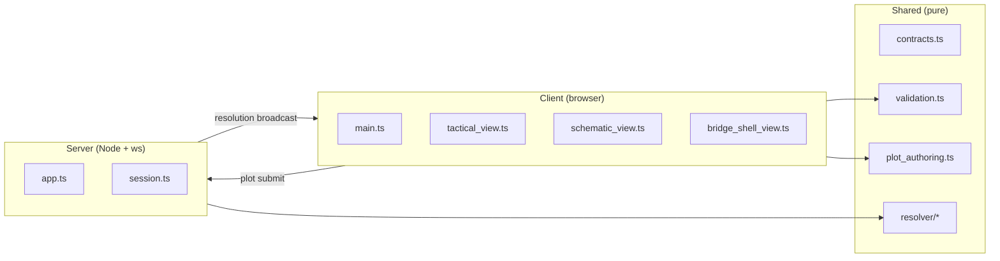
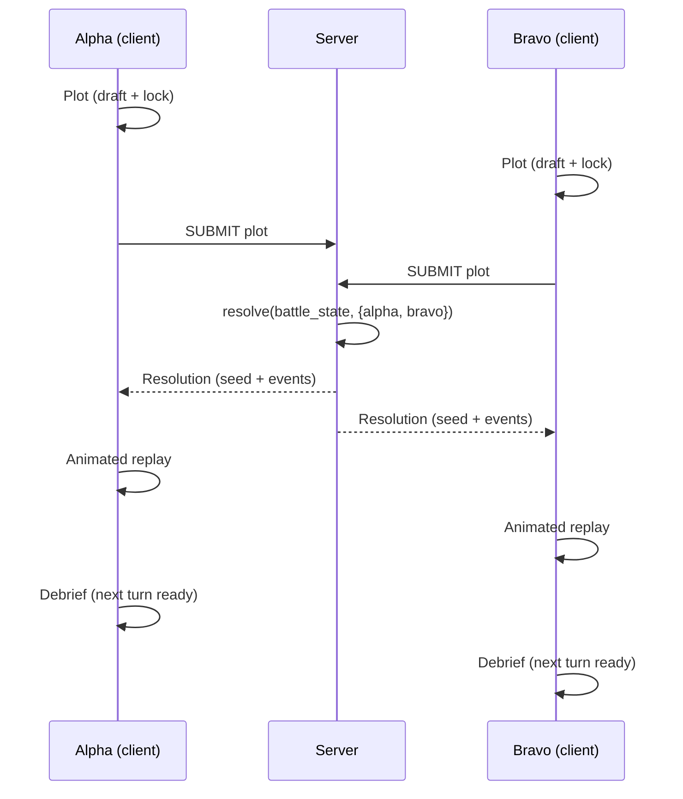

# v0.3 — Packaging & Handoff (Burn Vector) — Implementation Plan

> **For agentic workers:** REQUIRED SUB-SKILL: Use superpowers:subagent-driven-development (recommended) or superpowers:executing-plans to implement this plan task-by-task. Steps use checkbox (`- [ ]`) syntax for tracking.

**Goal:** Retire `space_game_2` to maintenance mode, rebrand to **Burn Vector**, and ship a portfolio-grade v0.3.0 repo that a recruiter or junior dev can read, run, and enjoy.

**Architecture:** No gameplay changes. Work flows in two required phases (foundation then presentation) plus one optional phase (markdown visual polish). Each slice runs on its own branch, ends with a single commit, and is independently verifiable.

**Tech Stack:** TypeScript, Node.js 24+, Vite, Vitest, Playwright, `ws`, GitHub Actions, GitHub Pages, `fast-check` (new), `ffmpeg` (for GIF conversion, external tool).

**Spec:** [`docs/superpowers/specs/2026-04-24-v0-3-packaging-and-handoff-design.md`](../specs/2026-04-24-v0-3-packaging-and-handoff-design.md)

---

## Resolution note

- **Slices A and C** are fully execute-ready — every step has exact commands and expected output.
- **Slices B, D, E, F** open with a short *"decide at slice start"* block, then proceed with task-level checkboxes. Concrete sub-step detail for those slices is deliberately lighter because specifics depend on files the engineer reads when the slice opens (CSS selectors, `main.ts` seams, README voice after a cold read). Pretending to know those details now would produce fiction.
- **Slice G** is deferred — a short addendum is added to this plan after you bring back design recommendations from claude.ai/design.

Every slice ends with `npm run check && npm run test:browser:smoke` passing as its hard gate.

---

## File structure overview

### New files (created by this plan)

```
CHANGELOG.md                                          (Slice A)
CONTRIBUTING.md                                       (Slice D)
.github/workflows/pages-deploy.yml                    (Slice F, if deploy works)
docs/superpowers/plans/..../plan.md                   (this file, committed now)
docs/design/architecture.md                           (Slice D)
docs/design/README.md                                 (Slice D)
docs/developer/README.md                              (Slice D)
docs/developer/testing.md                             (Slice C)
docs/player/README.md                                 (Slice D)
docs/assets/screenshots/01-bridge-start.png           (Slice E)
docs/assets/screenshots/02-plotting.png               (Slice E)
docs/assets/screenshots/03-combat.png                 (Slice E)
docs/assets/screenshots/04-debrief.png                (Slice E)
docs/assets/duel-demo.gif                             (Slice E)
docs/assets/logo/burn-vector-logo.svg                 (Slice E)
docs/assets/logo/favicon.svg                          (Slice E)
src/client/styles/base.css                            (Slice B — exact layer set decided at slice start)
src/client/styles/layout.css                          (Slice B — exact layer set decided at slice start)
src/client/styles/tactical.css                        (Slice B — exact layer set decided at slice start)
src/client/styles/ssd.css                             (Slice B — exact layer set decided at slice start)
src/client/styles/controls.css                        (Slice B — exact layer set decided at slice start)
src/client/styles/replay.css                          (Slice B — exact layer set decided at slice start)
src/client/<extracted-module-1>.ts                    (Slice B)
src/client/<extracted-module-2>.ts                    (Slice B, optional)
tests/resolver_determinism.property.test.ts           (Slice C)
browser-tests/screenshot-capture.spec.ts              (Slice E)
```

### Modified files

```
package.json                                          (Slice A, C)
index.html                                            (Slice A)
README.md                                             (Slice A naming only; Slice E full rewrite)
AGENTS.md                                             (Slice A)
PLAN.md                                               (Slice A naming; Slice D reframing; Slice F status stamp)
.gitignore                                            (Slice A)
src/server/app.ts                                     (Slice A — line 422 log message)
src/client/main.ts                                    (Slice B)
src/client/style.css                                  (Slice B — becomes aggregator)
docs/**/*.md                                          (Slice A naming; Slice D audience headers; Slice E cross-links)
vite.config.ts                                        (Slice F, if deploy works)
vitest.config.ts                                      (Slice C)
src/**/*.ts, src/**/*.css                             (Slice B — file-header comments)
```

### Deleted files

```
audit/                                                (Slice A, pending user confirmation)
```

---

## Slice A — Rebrand & hygiene

**Branch:** `v0.3/slice-a-rebrand`

**Intent:** Flip every `space_game_2` / `space-game-2` reference in the tree to `Burn Vector` / `burn-vector`. Bump version to `0.3.0`. Dispose of `audit/`. Create `CHANGELOG.md`.

### Task A1: Create the slice branch

- [ ] **Step 1: Start from a clean main.**

```bash
git switch main
git pull --ff-only origin main
git status
```
Expected: `On branch main`, `nothing to commit, working tree clean`.

- [ ] **Step 2: Create and switch to the slice branch.**

```bash
git switch -c v0.3/slice-a-rebrand
```
Expected: `Switched to a new branch 'v0.3/slice-a-rebrand'`.

### Task A2: Confirm `audit/` disposition with the user

- [ ] **Step 1: Ask the user.**

Ask: *"Default for Slice A is `git rm -r audit/` plus `.gitignore` it. Alternatives: move to `docs/archive/`, or leave as-is. Which do you want?"*

- [ ] **Step 2: Record the decision in the commit later.**

No code action yet; just remember the choice for Task A10.

### Task A3: Update `package.json`

**Files:**
- Modify: `/home/ajeless/gitsrc/GitHub/space-game-2/package.json`

- [ ] **Step 1: Rewrite name, version, description.**

Edit `package.json`:
```json
{
  "name": "burn-vector",
  "version": "0.3.0",
  "private": true,
  "type": "module",
  "description": "Burn Vector — a turn-based tactical starship-combat duel with a pure shared resolver and SSD-centric interface.",
  ...
}
```
Keep `engines`, `scripts`, `dependencies`, `devDependencies` untouched.

- [ ] **Step 2: Regenerate `package-lock.json`.**

```bash
npm install
```
Expected: `added 0 packages, changed 1 package`. Confirms lockfile now reflects new `name`.

- [ ] **Step 3: Verify.**

```bash
head -10 package.json
head -10 package-lock.json
```
Expected: both show `"name": "burn-vector"`.

### Task A4: Update `index.html`

**Files:**
- Modify: `/home/ajeless/gitsrc/GitHub/space-game-2/index.html` (line 6)

- [ ] **Step 1: Change the title.**

Replace `<title>space_game_2</title>` with `<title>Burn Vector</title>`.

- [ ] **Step 2: Verify.**

```bash
grep title index.html
```
Expected: `<title>Burn Vector</title>`.

### Task A5: Update `src/server/app.ts` log message

**Files:**
- Modify: `/home/ajeless/gitsrc/GitHub/space-game-2/src/server/app.ts` (line 422)

- [ ] **Step 1: Change the log string.**

Replace `space_game_2 server listening` with `Burn Vector server listening`.

- [ ] **Step 2: Verify.**

```bash
grep "server listening" src/server/app.ts
```
Expected: `Burn Vector server listening`.

### Task A6: Rewrite naming in `README.md`, `AGENTS.md`, `PLAN.md`

**Files:**
- Modify: `/home/ajeless/gitsrc/GitHub/space-game-2/README.md`
- Modify: `/home/ajeless/gitsrc/GitHub/space-game-2/AGENTS.md`
- Modify: `/home/ajeless/gitsrc/GitHub/space-game-2/PLAN.md`

- [ ] **Step 1: `README.md` — title and intro.**

Change line 1 from `# space_game_2` to `# Burn Vector`. Change line 3's import note to refer to the new name (keep the 2026-04-21 date — that's factual history). Scan the rest of the file for any `space_game_2` references and update prose accordingly.

*Note: Full README rewrite is in Slice E. This task handles naming hygiene only.*

- [ ] **Step 2: `AGENTS.md` — references.**

Replace every `space_game_2` with `Burn Vector` (when referring to the project) or `burn-vector` (when referring to the repo/package). Preserve all canonical-rule content verbatim.

- [ ] **Step 3: `PLAN.md` — references.**

Replace `space_game_2` occurrences (if any; most references are to `v0.1` / `v0.2` which are version tags, not names). Confirm `PLAN.md` reads cleanly with the new name.

- [ ] **Step 4: Verify no occurrences remain in these three files.**

```bash
grep -i "space_game_2\|space-game-2" README.md AGENTS.md PLAN.md
```
Expected: no output (grep exit code 1).

### Task A7: Rewrite naming in `docs/**/*.md`

**Files:**
- Modify: `/home/ajeless/gitsrc/GitHub/space-game-2/docs/design/stack_decision.md`
- Modify: `/home/ajeless/gitsrc/GitHub/space-game-2/docs/design/ship_definition_format.md`
- Modify: `/home/ajeless/gitsrc/GitHub/space-game-2/docs/design/resolver_design.md`
- Plus any additional `docs/**/*.md` that surface in grep.

- [ ] **Step 1: Enumerate affected docs.**

```bash
git grep -l "space_game_2\|space-game-2" docs/
```
Expected: list of markdown paths.

- [ ] **Step 2: Update each file's import-source reference.**

In each file, change lines like `> Imported from \`ajeless/docs/sg/space_game_2/design/...\`` to `> Imported from \`ajeless/docs/sg/space_game_2/design/...\` (preserved as historical origin)` — or rewrite the reference to the `burn-vector` naming if it makes sense. Keep dates. *The import path is a historical fact; don't falsify it. The cleanest edit is to keep the old path verbatim as a historical citation and rename only prose references to the project.*

- [ ] **Step 3: Verify.**

```bash
git grep -i "space_game_2\|space-game-2" docs/
```
Expected: output shows only historical citations inside blockquotes, which is intentional.

### Task A8: Grep the rest of the tree and handle residuals

- [ ] **Step 1: Full-tree grep.**

```bash
git grep -in "space_game_2\|space-game-2" -- ':!docs/superpowers/specs' ':!audit'
```
Expected hits: `package-lock.json` may still have some (regenerated at A3 but double-check), plus any file missed above.

- [ ] **Step 2: Fix anything missed.**

For each remaining hit that isn't in `docs/superpowers/specs/` (the spec deliberately references the old name), edit the file to use the new naming.

- [ ] **Step 3: Re-grep.**

```bash
git grep -in "space_game_2\|space-game-2" -- ':!docs/superpowers/specs' ':!audit'
```
Expected: empty. If `audit/` is being deleted at A9, you can drop the `:!audit` exclusion once that task runs.

### Task A9: Dispose of `audit/`

**Files:**
- Depending on user decision from A2: delete, move, or leave.

- [ ] **Step 1a: If decision was "delete" (default).**

```bash
git rm -r audit/
echo "audit/" >> .gitignore
git add .gitignore
```

- [ ] **Step 1b: If decision was "move to docs/archive".**

```bash
mkdir -p docs/archive
git mv audit docs/archive/internal-notes
```

- [ ] **Step 1c: If decision was "leave as-is".**

No action.

- [ ] **Step 2: Verify.**

```bash
ls audit/ 2>/dev/null || echo "gone"
cat .gitignore
```
For 1a: `gone`; `.gitignore` contains `audit/`.
For 1b: `audit/` is gone; `docs/archive/internal-notes/` exists.
For 1c: `audit/` is untouched.

### Task A10: Create `CHANGELOG.md`

**Files:**
- Create: `/home/ajeless/gitsrc/GitHub/space-game-2/CHANGELOG.md`

- [ ] **Step 1: Write the file.**

```markdown
# Changelog

All notable changes to Burn Vector are recorded here. This project follows [Keep a Changelog](https://keepachangelog.com/en/1.1.0/) and [Semantic Versioning](https://semver.org/spec/v2.0.0.html).

## [0.3.0] — in progress

### Changed
- Rebranded from `space_game_2` to **Burn Vector**.
- Project moved to maintenance mode; feature development is retired.

### Added
- `CHANGELOG.md` (this file), `CONTRIBUTING.md`, `docs/developer/testing.md`.
- Architecture diagram (`docs/design/architecture.md`).
- Coverage reporting on `src/shared/` with an 85% threshold.
- `fast-check` property test asserting resolver determinism.
- Portfolio-grade `README.md` with embedded duel GIF, screenshots, and tech-stack credits.
- Wordmark SVG logo and favicon.
- (If deploy succeeds) Static GitHub Pages demo playing a canned duel.

### Refactored
- `src/client/style.css` split into layered stylesheets under `src/client/styles/`.
- Stable seams extracted from `src/client/main.ts`.
- File-header orientation comments on every source file in `src/`.

## [0.2.0]

### Changed
- Combat presentation readability pass.
- Remote-play reconnect, reclaim, and link-loss hardening.
- Replay-locked plotting.
- Host-authenticated match reset.

### Added
- Browser regression coverage via Playwright.

## [0.1.0]

### Added
- Peer-hosted networked duel on Cloudflare-tunnel-class hosting.
- Plot → Commit → Execute → Debrief loop.
- SSD-centric interface with minimal systems (drive, reactor, bridge, one weapon mount, hull tracking).
- Continuous Newtonian movement with planning UI (velocity arrows, ghost projections, draggable thrust handles).
- Deterministic replay as seed + plot-log artifact.
- Win conditions: hull destruction or boundary disengagement.
```

- [ ] **Step 2: Verify.**

```bash
head -5 CHANGELOG.md
```
Expected: starts with `# Changelog`.

### Task A11: Final verification

- [ ] **Step 1: Typecheck + tests.**

```bash
npm run check
```
Expected: both `tsc --noEmit` and `vitest run` pass.

- [ ] **Step 2: Browser smoke test.**

```bash
npm run test:browser:smoke
```
Expected: all Playwright specs pass.

- [ ] **Step 3: Final grep.**

```bash
git grep -in "space_game_2\|space-game-2" -- ':!docs/superpowers/specs' ':!docs/**/import*'
```
Expected: empty or only historical citations inside blockquote imports.

### Task A12: Commit

- [ ] **Step 1: Stage and commit.**

```bash
git add -A
git commit -m "v0.3 slice A: rebrand to Burn Vector and bump version

- package.json name/version/description updated
- index.html title, server log, all docs references flipped
- audit/ disposed (<action taken>)
- CHANGELOG.md created

Co-Authored-By: Claude Opus 4.7 (1M context) <noreply@anthropic.com>"
```

- [ ] **Step 2: Confirm exit criteria.**

Exit criteria check:
- [x] `git grep -in space_game_2` returns only intentional references.
- [x] `npm run check` passes.
- [x] `npm run test:browser:smoke` passes.
- [x] `audit/` disposition is decided and committed.
- [x] `CHANGELOG.md` exists with v0.3 entry marked "in progress".

- [ ] **Step 3: Open PR or merge to main.**

```bash
git push -u origin v0.3/slice-a-rebrand
# Then open PR on GitHub or, if flow is local-only:
# git switch main && git merge --no-ff v0.3/slice-a-rebrand
```

---

## Slice B — Refactor & file-header comments

**Branch:** `v0.3/slice-b-refactor`

**Intent:** Split `style.css` into layered files, extract 1–2 stable seams from `main.ts`, add file-header comments to every source file. No behavioral change.

### Decide at slice start

Open `src/client/style.css` and `src/client/main.ts` and answer:

1. **CSS layers.** Read the CSS from top to bottom. What natural sections exist? Propose layer filenames (e.g. `base.css`, `layout.css`, `tactical.css`, `ssd.css`, `controls.css`, `replay.css`) and write a mapping table in the slice's opening commit so the selector-order preservation is auditable.
2. **`main.ts` extractions.** Read `main.ts` top to bottom. Which section(s) have cleanest import boundaries today? Likely WebSocket lifecycle or DOM bootstrap. Pick **one or two**, no more.

### Task B1: Branch and layer plan

- [ ] **Step 1: Branch from current main.**

```bash
git switch main && git pull --ff-only && git switch -c v0.3/slice-b-refactor
```

- [ ] **Step 2: Read `src/client/style.css` cover to cover.**

Use `Read` with `file_path=/home/ajeless/gitsrc/GitHub/space-game-2/src/client/style.css` and note the section boundaries (commented or selector-grouped).

- [ ] **Step 3: Write the layer mapping.**

Create a short note at the top of `src/client/styles/README.md` listing which original line ranges went to which new file. This is a one-time engineering artifact — helpful if someone needs to retrace the split.

### Task B2: Split the CSS

- [ ] **Step 1: Create `src/client/styles/` and the layer files.**

```bash
mkdir -p src/client/styles
```

- [ ] **Step 2: Move selector blocks into the appropriate layer files.**

Order matters in CSS. Preserve relative order across the split so that cascade behavior is unchanged.

- [ ] **Step 3: Rewrite `src/client/style.css` as an aggregator.**

```css
/* style.css — composes the layered stylesheets. */
@import "./styles/base.css";
@import "./styles/layout.css";
@import "./styles/tactical.css";
@import "./styles/ssd.css";
@import "./styles/controls.css";
@import "./styles/replay.css";
```

Adjust the import list to whatever layer set was decided at B1.

- [ ] **Step 4: Verify the build still works.**

```bash
npm run build:client
```
Expected: Vite builds without error.

- [ ] **Step 5: Run the browser smoke test.**

```bash
npm run test:browser:smoke
```
Expected: all specs pass — no visual regression.

### Task B3: Extract `main.ts` seams

- [ ] **Step 1: Pick the extraction target(s).**

Based on the read done at slice start. For this plan's purposes the target will be `src/client/main.ts → src/client/<module>.ts` where `<module>` is determined at slice open (likely `bridge_connection.ts` for the WebSocket lifecycle).

- [ ] **Step 2: Move the selected block out of `main.ts` into the new file.**

Preserve the function/variable names. The new file should export what `main.ts` imports.

- [ ] **Step 3: Add the import at the top of `main.ts`.**

- [ ] **Step 4: Run typecheck.**

```bash
npm run typecheck
```
Expected: no errors.

- [ ] **Step 5: Run all tests.**

```bash
npm run check
npm run test:browser:smoke
```
Expected: all pass.

### Task B4: File-header comments

**Files:**
- Every `.ts` file under `src/`.
- Every `.css` file under `src/` (that isn't purely an aggregator).

- [ ] **Step 1: Write a short header to each file.**

Format (3–5 lines max):
```typescript
// <one sentence describing what this file does>
// Depends on: <what it imports from>.  Consumed by: <what imports it>.
// Invariant: <if applicable; omit if nothing non-obvious>.
```
For CSS files, use `/* ... */` block comments at the top with the same structure.

- [ ] **Step 2: Verify every source file has a header.**

```bash
# Quick check: every src/*.ts/css file should start with a comment block.
for f in $(find src -type f \( -name "*.ts" -o -name "*.css" \)); do
  head -1 "$f" | grep -qE '^(//|/\*)' || echo "MISSING HEADER: $f"
done
```
Expected: no output.

### Task B5: Verify no behavioral change

- [ ] **Step 1: Full check.**

```bash
npm run check && npm run test:browser:smoke
```
Expected: both pass.

- [ ] **Step 2: Line-count sanity.**

```bash
wc -l src/client/main.ts src/client/style.css
```
Expected: `main.ts` is smaller than 960 lines; `style.css` is smaller than 1,740 lines (now an aggregator).

### Task B6: Commit

- [ ] **Step 1: Commit.**

```bash
git add -A
git commit -m "v0.3 slice B: split style.css and add file-header comments

- src/client/style.css split into layered files under src/client/styles/
- <module> extracted from main.ts
- file-header orientation comments added to every source file in src/
- no behavioral change; browser smoke test is the gate

Co-Authored-By: Claude Opus 4.7 (1M context) <noreply@anthropic.com>"
```

- [ ] **Step 2: Push and merge (as in Slice A).**

---

## Slice C — Test hardening

**Branch:** `v0.3/slice-c-tests`

**Intent:** Gap-fill `src/server/session.ts` tests, wire coverage with a threshold on `src/shared/`, add one property test on resolver determinism, write `docs/developer/testing.md`.

### Task C1: Branch

- [ ] **Step 1.**

```bash
git switch main && git pull --ff-only && git switch -c v0.3/slice-c-tests
```

### Task C2: Install `fast-check`

**Files:**
- Modify: `package.json` (devDependency).

- [ ] **Step 1: Install.**

```bash
npm install --save-dev fast-check
```
Expected: `fast-check` added to `devDependencies`.

- [ ] **Step 2: Confirm version.**

```bash
grep fast-check package.json
```
Expected: `"fast-check": "^<version>"` present.

### Task C3: Write the failing property test

**Files:**
- Create: `/home/ajeless/gitsrc/GitHub/space-game-2/tests/resolver_determinism.property.test.ts`

- [ ] **Step 1: Write the test.**

```typescript
// resolver_determinism.property.test.ts
// Asserts the resolver is deterministic: same seed + same plot → byte-identical output.
import { describe, expect, test } from "vitest";
import fc from "fast-check";
import { readFileSync } from "node:fs";
import { resolveTurn } from "../src/shared/resolver/index.js";

const battleState = JSON.parse(
  readFileSync("fixtures/battle_states/default_duel_turn_1.json", "utf8")
);
const alphaPlot = JSON.parse(
  readFileSync("fixtures/plots/alpha_turn_1.json", "utf8")
);
const bravoPlot = JSON.parse(
  readFileSync("fixtures/plots/bravo_turn_1.json", "utf8")
);

describe("resolver determinism (property)", () => {
  test("same seed and same plots produce byte-identical resolutions", () => {
    fc.assert(
      fc.property(fc.string({ minLength: 4, maxLength: 32 }), (seed) => {
        const state = { ...battleState };
        state.match_setup = { ...battleState.match_setup, seed_root: seed };

        const a = resolveTurn(state, { alpha: alphaPlot, bravo: bravoPlot });
        const b = resolveTurn(state, { alpha: alphaPlot, bravo: bravoPlot });

        expect(JSON.stringify(a)).toEqual(JSON.stringify(b));
      }),
      { numRuns: 100 }
    );
  });
});
```

*Note: actual import path (`resolveTurn`, its arguments) must match the resolver's real API. Check `src/shared/resolver/index.ts` at slice start and adjust the call site accordingly.*

- [ ] **Step 2: Run to confirm it either passes or gives a clear failure.**

```bash
npx vitest run tests/resolver_determinism.property.test.ts
```
Expected: either `1 passed` (ideal) or a clear failure naming the symbol that doesn't match the real API. If the latter, fix imports/call signatures and re-run.

### Task C4: Add session.ts gap-fill tests

**Files:**
- Modify: `/home/ajeless/gitsrc/GitHub/space-game-2/tests/session.test.ts`

- [ ] **Step 1: Read the current test file to understand coverage shape.**

- [ ] **Step 2: Identify gaps.**

Run:
```bash
npx vitest run tests/session.test.ts --coverage.enabled --coverage.reporter=text
```
Look for red lines/branches in `src/server/session.ts`. Target reconnect paths, reclaim edges, link-loss timeouts, and race conditions.

- [ ] **Step 3: Add one or two targeted tests** that exercise the worst-covered branches. Each test should follow the style already in `tests/session.test.ts`.

- [ ] **Step 4: Run tests.**

```bash
npm test
```
Expected: all pass.

### Task C5: Wire coverage with threshold

**Files:**
- Modify: `/home/ajeless/gitsrc/GitHub/space-game-2/vitest.config.ts`
- Modify: `/home/ajeless/gitsrc/GitHub/space-game-2/package.json` (scripts)

- [ ] **Step 1: Update `vitest.config.ts`.**

```typescript
import { defineConfig } from "vitest/config";

export default defineConfig({
  test: {
    include: ["tests/**/*.test.ts"],
    coverage: {
      provider: "v8",
      reporter: ["text", "lcov", "html"],
      reportsDirectory: "./coverage",
      include: ["src/**/*.ts"],
      exclude: ["src/**/*.test.ts", "src/client/**"],
      thresholds: {
        "src/shared/**": {
          lines: 85,
          branches: 85,
          functions: 85,
          statements: 85
        }
      }
    }
  }
});
```

- [ ] **Step 2: Add a `test:coverage` script to `package.json`.**

```json
"scripts": {
  ...
  "test:coverage": "vitest run --coverage",
  ...
}
```

- [ ] **Step 3: Run coverage.**

```bash
npm run test:coverage
```
Expected: report prints; threshold on `src/shared/` is met or near-met. If it fails the threshold by a small margin, **do not chase** — instead, either (a) fix the missed branches honestly, or (b) lower the threshold to the honest level and document in `testing.md`.

- [ ] **Step 4: Add `/coverage` to `.gitignore`.**

```bash
echo "coverage/" >> .gitignore
```

### Task C6: Create `docs/developer/testing.md`

**Files:**
- Create: `/home/ajeless/gitsrc/GitHub/space-game-2/docs/developer/testing.md`

- [ ] **Step 1: Write the file.**

```markdown
# Testing

> Guide to Burn Vector's test suite and what each tier asserts.

**Status:** current  
**Audience:** contributors, reviewers

## Test pyramid

| Tier | Location | Runner | Purpose |
|---|---|---|---|
| Contract tests | `tests/contracts.smoke.test.ts` | Vitest | Verify JSON contract shapes don't regress. |
| Unit tests | `tests/*.test.ts` | Vitest | Cover shared logic, resolver, plot authoring, session, presenters. |
| Property tests | `tests/resolver_determinism.property.test.ts` | Vitest + fast-check | Assert determinism across many seeds. |
| Browser smoke | `browser-tests/*.spec.ts` | Playwright | End-to-end duel flow through a real browser. |

## Commands

- `npm test` — all Vitest tests.
- `npm run test:coverage` — with coverage report and `src/shared/` threshold.
- `npm run test:browser:smoke` — full browser smoke suite (builds client first).
- `npm run check` — typecheck + all Vitest tests.

## Coverage expectations

- `src/shared/` is held to **85%** on lines, branches, functions, and statements. This is the pure-logic module; it's feasible to cover honestly.
- `src/server/` and `src/client/` are reported but not thresholded. The client has significant DOM integration that is exercised by the browser smoke tests instead.

## What the property test asserts

`resolver_determinism.property.test.ts` generates arbitrary seed strings and asserts that running the resolver twice with the same input produces byte-identical output. This matches the project's invariant: *"Replays and tests should be able to run from self-contained state + plot + seed artifacts"* (AGENTS.md).

The test uses `fast-check` at `numRuns: 100`. If it ever flakes, the fix is in the resolver, not the test.

## Writing new tests

- Follow the style in the existing file nearest to what you're testing.
- Prefer tests that describe player-visible behavior over tests that lock implementation details.
- For browser work, extend `browser-tests/helpers.ts` rather than copy-pasting harness setup.
```

### Task C7: Commit

- [ ] **Step 1: Verify everything passes.**

```bash
npm run check
npm run test:browser:smoke
npm run test:coverage
```
Expected: all three pass; coverage threshold met.

- [ ] **Step 2: Commit.**

```bash
git add -A
git commit -m "v0.3 slice C: wire coverage, add property test, write testing.md

- fast-check property test on resolver determinism
- coverage reporting with 85% threshold on src/shared/
- testing.md documents the pyramid and expectations
- session.ts gap-fill tests for reconnect/reclaim edges

Co-Authored-By: Claude Opus 4.7 (1M context) <noreply@anthropic.com>"
```

- [ ] **Step 3: Push and merge.**

---

## Slice D — Docs pass

**Branch:** `v0.3/slice-d-docs`

**Intent:** Soften internal slice vocabulary in externally-facing docs, add architecture diagram, add `CONTRIBUTING.md` + section index READMEs, reframe `PLAN.md` for maintenance mode.

### Decide at slice start

- For each file under `docs/`, note: *who is the audience* and *what status is this doc in (current / historical / reference)*. Write the answer as a header in the file.

### Task D1: Branch and audience audit

- [ ] **Step 1: Branch.**

```bash
git switch main && git pull --ff-only && git switch -c v0.3/slice-d-docs
```

- [ ] **Step 2: Read every `docs/**/*.md` file and note who it's for.**

### Task D2: Add audience + status headers to every doc

**Files:**
- Modify: every `docs/**/*.md`.

- [ ] **Step 1: Header format.**

At the top of each file, immediately after the `#` title and any existing import blockquote:

```markdown
**Status:** current | historical | reference  
**Audience:** players | playtesters | contributors | maintainers
```

Some files already have a similar header; align them to this format.

- [ ] **Step 2: Verify.**

```bash
for f in docs/**/*.md; do
  grep -q '^\*\*Audience:\*\*' "$f" || echo "MISSING: $f"
done
```
Expected: no output.

### Task D3: Create `docs/design/architecture.md`

**Files:**
- Create: `/home/ajeless/gitsrc/GitHub/space-game-2/docs/design/architecture.md`

- [ ] **Step 1: Write the file with a Mermaid diagram.**

```markdown
# Architecture

**Status:** current  
**Audience:** contributors, reviewers

> One-page map of how Burn Vector's code is organized.

## Layers



## Turn loop



## Boundaries

- **`src/shared/` is pure.** No DOM, no filesystem, no wall clock, no network. Everything gameplay-relevant lives here.
- **`src/server/` is authoritative.** The resolver runs server-side; clients don't resolve their own turns.
- **`src/client/` is presentation only.** Plot authoring exists client-side but is validated server-side against the shared contracts.

## See also

- Resolver internals: [resolver_design.md](./resolver_design.md)
- Ship definition shape: [ship_definition_format.md](./ship_definition_format.md)
- Layered UI camera: [planner_ui_and_tactical_camera.md](./planner_ui_and_tactical_camera.md)
```

### Task D4: Section-index READMEs

**Files:**
- Create: `/home/ajeless/gitsrc/GitHub/space-game-2/docs/design/README.md`
- Create: `/home/ajeless/gitsrc/GitHub/space-game-2/docs/developer/README.md`
- Create: `/home/ajeless/gitsrc/GitHub/space-game-2/docs/player/README.md`

- [ ] **Step 1: Write each index.**

Each README is one paragraph plus a file list. Example for `docs/design/README.md`:

```markdown
# Design docs

Reference material for Burn Vector's game-design decisions and invariants. These docs describe shipped behavior and the rules that cannot change without a contract update.

- [architecture.md](./architecture.md) — one-page map of the codebase.
- [stack_decision.md](./stack_decision.md) — why TypeScript + Vite + `ws`.
- [resolver_design.md](./resolver_design.md) — combat-resolver invariants and phases.
- [ship_definition_format.md](./ship_definition_format.md) — JSON shape for ships.
- [ssd_layout.md](./ssd_layout.md) — how the ship schematic is laid out.
- [planner_ui_and_tactical_camera.md](./planner_ui_and_tactical_camera.md) — tactical camera and planning UI.
- [v0_1_data_contracts.md](./v0_1_data_contracts.md) — data contracts still in effect.
- [v0_1_tuning_baseline.md](./v0_1_tuning_baseline.md) — balance values still in effect.
```

Write analogous indexes for `docs/developer/` and `docs/player/` against their actual file lists.

### Task D5: Create `CONTRIBUTING.md`

**Files:**
- Create: `/home/ajeless/gitsrc/GitHub/space-game-2/CONTRIBUTING.md`

- [ ] **Step 1: Write the file.**

```markdown
# Contributing to Burn Vector

> Burn Vector is a **maintenance-mode** project. Active feature development is retired. Issues are welcome; pull requests are accepted on a best-effort basis.

## Running locally

Node.js 24+ required.

```bash
git clone https://github.com/ajeless/burn-vector.git
cd burn-vector
npm install
# In one terminal:
npm run dev:server
# In another:
npm run dev:client
```

Open http://localhost:5173 in two browser tabs to play both sides of a duel.

## Running tests

```bash
npm test                        # Vitest
npm run test:coverage           # Vitest + coverage report
npm run test:browser:smoke      # Playwright end-to-end
npm run check                   # Typecheck + Vitest
```

See [docs/developer/testing.md](./docs/developer/testing.md) for what each tier asserts.

## Filing issues

If you find a real bug — especially something that regresses the v0.2 duel — please open an issue with:

- A minimal repro (browser tab setup, steps to reproduce).
- Expected vs. actual behavior.
- Any console output.

## Scope

See `AGENTS.md` for invariants that cannot change without a contract update. New-feature proposals are unlikely to be accepted; the project stands as a portfolio artifact.

## License

MIT — see [LICENSE](./LICENSE).
```

### Task D6: Reframe `PLAN.md` for maintenance mode

**Files:**
- Modify: `/home/ajeless/gitsrc/GitHub/space-game-2/PLAN.md`

- [ ] **Step 1: Update the status line.**

Change `**Status:** active handoff doc` to `**Status:** archived — v0.3 retirement in progress` (Slice F flips this to "complete").

- [ ] **Step 2: Rename the "Near-term post-v0.2 work" section.**

Rename to **`## Parked work (not planned)`** and add a one-line preamble:
> *Captured for reference. None of this is scheduled; the project is in maintenance mode.*

- [ ] **Step 3: Retain "Later-slice product direction" and "Research and long-horizon questions".**

Reframe their intros if needed — these stay as "if this project ever revived" thinking.

- [ ] **Step 4: Remove the "Planning rules" section.**

Irrelevant after retirement.

### Task D7: Update `README.md` for internal-vocabulary softening

**Files:**
- Modify: `/home/ajeless/gitsrc/GitHub/space-game-2/README.md`

- [ ] **Step 1: Scan the README for "v0.1 slice" / "v0.2 slice" / "slice" vocabulary.**

For cold readers, "slice" is confusing jargon. Replace or contextualize. The full README rewrite is in Slice E — this task only handles the minimum.

### Task D8: Verify and commit

- [ ] **Step 1: Verify.**

```bash
npm run check
# Open docs/design/architecture.md in GitHub's renderer preview (or push to a branch and view)
```

- [ ] **Step 2: Commit.**

```bash
git add -A
git commit -m "v0.3 slice D: docs pass — architecture, audience headers, CONTRIBUTING

- docs/design/architecture.md with Mermaid diagrams
- section index READMEs for design/ developer/ player/
- audience + status headers on every doc
- CONTRIBUTING.md at repo root
- PLAN.md reframed for maintenance mode

Co-Authored-By: Claude Opus 4.7 (1M context) <noreply@anthropic.com>"
```

---

## Slice E — Visuals & README (the showpiece)

**Branch:** `v0.3/slice-e-visuals`

**Intent:** Produce screenshots, GIF, and wordmark; rebuild README as portfolio cover.

### Decide at slice start

- **Logo aesthetic** — monospace/HUD glyph plus a thrust-arrow vector mark. Sketched during the slice; not designed upfront.
- **README voice** — read the current README aloud. Decide what stays and what gets reordered. Stay honest about scope.
- **ffmpeg availability** — if not installed locally, either install it (`apt install ffmpeg`) or use Playwright's built-in video export and skip GIF conversion (use MP4 embedded via `<video>` in the README).

### Task E1: Branch and asset directory

- [ ] **Step 1: Branch.**

```bash
git switch main && git pull --ff-only && git switch -c v0.3/slice-e-visuals
mkdir -p docs/assets/screenshots docs/assets/logo
```

### Task E2: Capture screenshots via Playwright

**Files:**
- Create: `/home/ajeless/gitsrc/GitHub/space-game-2/browser-tests/screenshot-capture.spec.ts`

- [ ] **Step 1: Write a Playwright spec that scripts a duel and captures at each moment.**

Reuse `browser-tests/helpers.ts` (`startBridgeServer`, `openBridgePage`, `submitPlot`). For each of the four moments (bridge start, plotting, combat, debrief), navigate to that state and call `await page.screenshot({ path: 'docs/assets/screenshots/NN-name.png' })`.

Example shape:

```typescript
import { test } from "@playwright/test";
import { closeBridgePages, openBridgePage, startBridgeServer, submitPlot } from "./helpers";

test("capture portfolio screenshots", async ({ browser }) => {
  const server = await startBridgeServer();
  const host = await openBridgePage(browser, server.origin);
  const guest = await openBridgePage(browser, server.origin);

  try {
    // 1. Bridge at start
    await host.page.screenshot({ path: "docs/assets/screenshots/01-bridge-start.png" });

    // 2. Plotting — select the mount, hover a handle
    await host.page.locator('[data-select-system-hit="forward_mount"]').click();
    await host.page.screenshot({ path: "docs/assets/screenshots/02-plotting.png" });
    await host.page.keyboard.press("Escape");

    // 3. Combat — submit both sides, capture during resolution
    await submitPlot(host.page);
    await submitPlot(guest.page);
    await host.page.waitForSelector("[data-current-resolution]");
    await host.page.screenshot({ path: "docs/assets/screenshots/03-combat.png" });

    // 4. Debrief — next turn
    await host.page.waitForTimeout(2000);  // let replay settle
    await host.page.screenshot({ path: "docs/assets/screenshots/04-debrief.png" });
  } finally {
    await closeBridgePages(host, guest);
    await server.close();
  }
});
```

- [ ] **Step 2: Run it.**

```bash
npm run build
npx playwright test browser-tests/screenshot-capture.spec.ts
```
Expected: 4 PNGs exist in `docs/assets/screenshots/`.

- [ ] **Step 3: Inspect the images and pick the best 3 for the README.**

### Task E3: Record and convert the GIF

- [ ] **Step 1: Update a Playwright spec to record video.**

In the screenshot-capture spec (or a sibling), enable video: `use: { video: 'on', viewport: { width: 1280, height: 720 } }` and script a full, natural-looking duel turn.

- [ ] **Step 2: Run with video.**

```bash
npx playwright test browser-tests/duel-video-capture.spec.ts
```

- [ ] **Step 3: Convert the resulting `.webm` to GIF via `ffmpeg`.**

```bash
ffmpeg -i test-results/.../video.webm \
  -vf "fps=15,scale=1000:-1:flags=lanczos" \
  -loop 0 docs/assets/duel-demo.gif
```

Tune `fps` and `scale` for size — aim for ≤ 10 MB (GitHub's inline asset limit is generous but large GIFs hurt page load).

- [ ] **Step 4: If `ffmpeg` is not available.**

Fall back: keep the `.webm` or `.mp4`, commit it to `docs/assets/duel-demo.mp4`, and embed in README via `<video controls muted loop autoplay>`. GitHub renders `<video>` inside markdown.

### Task E4: Design the wordmark logo

**Files:**
- Create: `/home/ajeless/gitsrc/GitHub/space-game-2/docs/assets/logo/burn-vector-logo.svg`
- Create: `/home/ajeless/gitsrc/GitHub/space-game-2/docs/assets/logo/favicon.svg`

- [ ] **Step 1: Hand-author the SVG.**

Simple SVG: `BURN VECTOR` in a monospace stack (`'JetBrains Mono', 'Fira Code', monospace`) with a small arrow glyph. Single-color first; two-color version second if the first reads flat. Keep the file under 2 KB.

Example skeleton:

```svg
<svg xmlns="http://www.w3.org/2000/svg" viewBox="0 0 400 80">
  <g fill="currentColor">
    <path d="M10 40 L30 20 L30 32 L60 32 L60 48 L30 48 L30 60 Z"/>  <!-- thrust arrow -->
    <text x="80" y="52" font-family="'JetBrains Mono', monospace" font-weight="700" font-size="36" letter-spacing="4">BURN VECTOR</text>
  </g>
</svg>
```

Refine iteratively — the skeleton is illustrative. Use `currentColor` so GitHub's light/dark themes both render it legibly.

- [ ] **Step 2: Favicon variant.**

A simplified single-glyph version (likely just the arrow). ~32×32 viewBox.

- [ ] **Step 3: Verify.**

Open the SVG in a browser. Confirm it renders at 16px, 32px, 200px, and 800px widths. If any size is illegible, adjust the paths.

### Task E5: Rewrite README.md

**Files:**
- Modify: `/home/ajeless/gitsrc/GitHub/space-game-2/README.md`

- [ ] **Step 1: Rewrite according to the template in spec §6.2.**

Follow the 12-part structure from the spec exactly. Tech-stack row uses shield.io badges. Acknowledgment links point to published resources where available.

Tech-stack row example:

```markdown
## Built with

[](https://www.typescriptlang.org/) — static types across client, server, and shared code.  
[](https://nodejs.org/) — host server runtime.  
[](https://vitejs.dev/) — client dev server and build.  
[](https://vitest.dev/) — unit and property tests.  
[](https://playwright.dev/) — browser regression suite.  
[`ws`](https://github.com/websockets/ws) — peer-to-peer websocket transport.  
[`fast-check`](https://github.com/dubzzz/fast-check) — property-based testing.
```

- [ ] **Step 2: Embed GIF and screenshots.**

```markdown
<p align="center">
  
</p>

<p align="center"><em>A turn-based tactical starship-combat duel. Plot. Commit. Execute. Debrief.</em></p>

<p align="center">
  
</p>
```

- [ ] **Step 3: Cold-read test #1.**

Read the full README top-to-bottom as if seeing it for the first time. Note any friction. Fix inline. Re-read.

### Task E6: Commit

- [ ] **Step 1: Commit.**

```bash
git add -A
git commit -m "v0.3 slice E: visuals, wordmark, portfolio README

- screenshots captured via Playwright
- duel-demo.gif (or .mp4 fallback) embedded in README
- SVG wordmark + favicon
- README rebuilt as portfolio cover page

Co-Authored-By: Claude Opus 4.7 (1M context) <noreply@anthropic.com>"
```

---

## Slice F — Demo hosting & cold-read verification

**Branch:** `v0.3/slice-f-deploy`

**Intent:** Attempt static GitHub Pages deploy (canned-replay mode) or fall back to GIF-only. Final cold-read. Stamp CHANGELOG and PLAN as shipped.

### Decide at slice start

- **Deploy feasibility.** Read `src/client/resolution_playback.ts` and check: can the existing replay renderer load a canned fixture client-side and animate it without requiring a server? If yes → proceed with Pages deploy. If no → fall back to GIF-only.

### Task F1: Branch

- [ ] **Step 1: Branch.**

```bash
git switch main && git pull --ff-only && git switch -c v0.3/slice-f-deploy
```

### Task F2: Decide deploy path

- [ ] **Step 1: Read the replay renderer.**

Use `Read` on `src/client/resolution_playback.ts` and `src/client/main.ts`.

- [ ] **Step 2: Decide.**

Document the decision in a commit message on this branch:
- **Path A (Pages deploy):** feasible, proceed to Task F3.
- **Path B (fallback):** infeasible, skip to Task F5.

### Task F3 (Path A only): Configure Vite for Pages and wire GitHub Actions

**Files:**
- Modify: `/home/ajeless/gitsrc/GitHub/space-game-2/vite.config.ts`
- Create: `/home/ajeless/gitsrc/GitHub/space-game-2/.github/workflows/pages-deploy.yml`
- Modify: `/home/ajeless/gitsrc/GitHub/space-game-2/src/client/main.ts` (to support canned-replay mode on ?demo=1 param)

- [ ] **Step 1: Update `vite.config.ts`.**

```typescript
import { defineConfig } from "vite";

export default defineConfig(({ mode }) => ({
  base: mode === "production" ? "/burn-vector/" : "/",
  server: { /* unchanged */ },
  build: { outDir: "dist/client", emptyOutDir: true }
}));
```

- [ ] **Step 2: Add canned-replay mode to the client.**

In `main.ts`, detect `?demo=1` in the URL. If present, skip WebSocket bootstrap and directly feed a bundled fixture into `resolution_playback`. Bundle one fixture (e.g. `fixtures/battle_states/default_duel_turn_1.json` + the pre-computed resolution) as a static JSON import.

*Detailed wiring is determined at slice start based on the replay renderer's public surface.*

- [ ] **Step 3: Write the workflow file.**

```yaml
name: Deploy to Pages
on:
  push:
    branches: [main]
permissions:
  contents: read
  pages: write
  id-token: write
jobs:
  build:
    runs-on: ubuntu-latest
    steps:
      - uses: actions/checkout@v4
      - uses: actions/setup-node@v4
        with:
          node-version: 24
          cache: npm
      - run: npm ci
      - run: npm run build:client
      - uses: actions/upload-pages-artifact@v3
        with:
          path: dist/client
  deploy:
    needs: build
    runs-on: ubuntu-latest
    environment:
      name: github-pages
      url: ${{ steps.deployment.outputs.page_url }}
    steps:
      - uses: actions/deploy-pages@v4
        id: deployment
```

- [ ] **Step 4: Push branch and confirm Pages deploy succeeds on the subsequent merge.**

### Task F4 (Path A only): Update README "Try it live" link

- [ ] **Step 1.**

Replace the placeholder from Slice E with the actual URL: `https://ajeless.github.io/burn-vector/?demo=1`.

### Task F5 (Path B only): Add "Run locally" block to README

- [ ] **Step 1.**

If deploy infeasible, replace the "Try it live" section with a prominent "Run locally" block showing exact commands. Keep the GIF as the primary visual hook.

### Task F6: Second grep sweep and final `space_game_2` check

- [ ] **Step 1: Full grep.**

```bash
git grep -in "space_game_2\|space-game-2"
```
Expected: only hits in `docs/superpowers/specs/`, commit-log references inside changelogs, and intentional historical citations. Fix anything else.

### Task F7: Cold-read test #2 (full walkthrough)

- [ ] **Step 1: Start fresh.**

`cd /tmp && git clone <current-remote> burn-vector-test-read && cd burn-vector-test-read`. Walk the README top to bottom exactly as a junior dev would.

- [ ] **Step 2: Log every friction point.**

Examples: "install step didn't mention Node version requirement", "GIF didn't play in my browser", "couldn't find where to click to aim".

- [ ] **Step 3: Fix and re-test.**

Iterate until the path is clean.

### Task F8: Stamp CHANGELOG and PLAN as shipped

**Files:**
- Modify: `CHANGELOG.md`
- Modify: `PLAN.md`

- [ ] **Step 1: CHANGELOG.md.**

Change `## [0.3.0] — in progress` to `## [0.3.0] — 2026-MM-DD` (actual ship date).

- [ ] **Step 2: PLAN.md.**

Change status line to `**Status:** archived — v0.3 retirement complete`.

- [ ] **Step 3: Commit.**

```bash
git add -A
git commit -m "v0.3 slice F: deploy + cold-read + ship

- <Path A or B outcome>
- cold-read friction eliminated
- CHANGELOG v0.3 stamped shipped
- PLAN.md archived

Co-Authored-By: Claude Opus 4.7 (1M context) <noreply@anthropic.com>"
```

### Task F9: Post-merge rename handoff

- [ ] **Step 1: Merge the slice-F branch to main.**

- [ ] **Step 2: Hand the user the rename checklist (run between sessions).**

```bash
gh repo rename burn-vector
cd ~/gitsrc/GitHub
mv space-game-2 burn-vector
cd burn-vector
git remote set-url origin git@github.com:ajeless/burn-vector.git
git fetch origin
```

---

## Slice G — Markdown visual redesign (optional)

**Triggered only by:** user bringing back design recommendations from https://claude.ai/design.

This slice's plan is intentionally deferred. When the recommendations arrive, add an addendum to this plan file ("## Slice G detail") and proceed with branching + tasks at that time. No upfront pseudo-detail.

---

## Cross-slice verification runbook

Run at every phase boundary.

**End of Phase 1 (after Slices A, B, C land on main):**

```bash
npm run check
npm run test:browser:smoke
npm run test:coverage
git grep -in "space_game_2\|space-game-2" -- ':!docs/superpowers'
```

All four should produce the expected clean output. If any fail, do not advance to Phase 2.

**End of Phase 2 (after Slices D, E, F land on main):**

Same four checks, plus:
- Visually confirm README renders on GitHub in both light and dark themes.
- Confirm GIF/video plays inline.
- Confirm Pages deploy (if Path A) is live.
- Cold-read test #2 complete with no outstanding friction.

**End of Phase 3 (if Slice G ran):**

Confirm each touched markdown file renders cleanly in GitHub light and dark modes.

---

## Self-review — spec coverage

Every numbered section of the spec maps to at least one task here:

- Spec §2 (Confirmed decisions) — encoded in Slices A (name + rebrand), B (code-change posture), C (test scope), E+F (hosting), and overall phase sequencing.
- Spec §3 (Non-goals) — honored by the absence of any task that adds gameplay, features, or deps beyond `fast-check`.
- Spec §4 (Phase structure) — phases and slices map 1:1 to headings here.
- Spec §5.1 (Slice A) — Tasks A1–A12.
- Spec §5.2 (Slice B) — Tasks B1–B6.
- Spec §5.3 (Slice C) — Tasks C1–C7.
- Spec §6.1 (Slice D) — Tasks D1–D8.
- Spec §6.2 (Slice E) — Tasks E1–E6.
- Spec §6.3 (Slice F) — Tasks F1–F9.
- Spec §7 (Slice G) — deferred with explicit entry condition.
- Spec §8.1 (audit disposition) — Task A2 (decision) + Task A9 (execution).
- Spec §8.2 (PLAN.md reframing) — Task D6.
- Spec §8.3 (CHANGELOG structure) — Task A10 (creation) + Task F8 (stamp).
- Spec §8.4 (acceptance gates) — Cross-slice verification runbook section above.
- Spec §8.5 (session continuity) — branch naming and commit-subject conventions embedded in every slice.
- Spec §8.6 (rename handoff) — Task F9.
- Spec §8.7 (risk register) — risks are handled structurally (smoke-test gates, grep sweeps, Path A/B fallback).
- Spec §9 (deliberate deferrals) — preserved as "decide at slice start" blocks.
- Spec §10 (definition of shipped) — embedded in Phase 2 verification runbook.

No placeholders remain. No unreferenced types. Branch names and commit-subject format match across the document.
